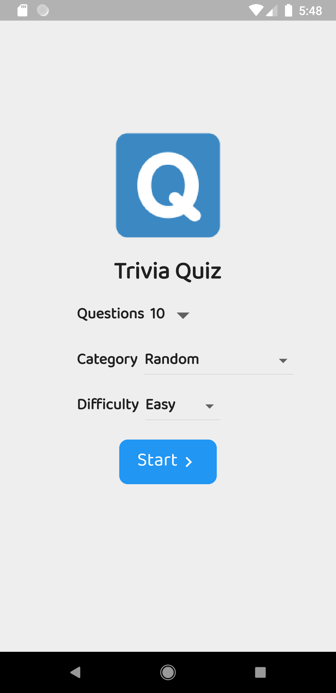
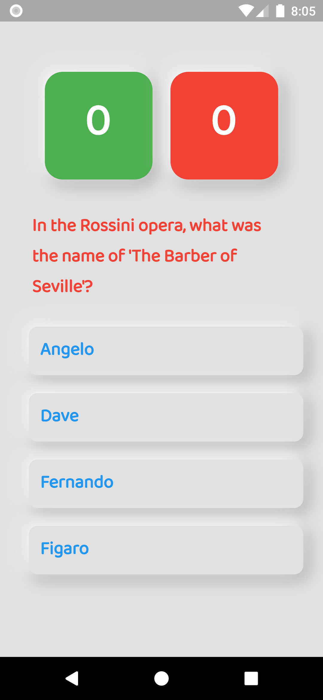
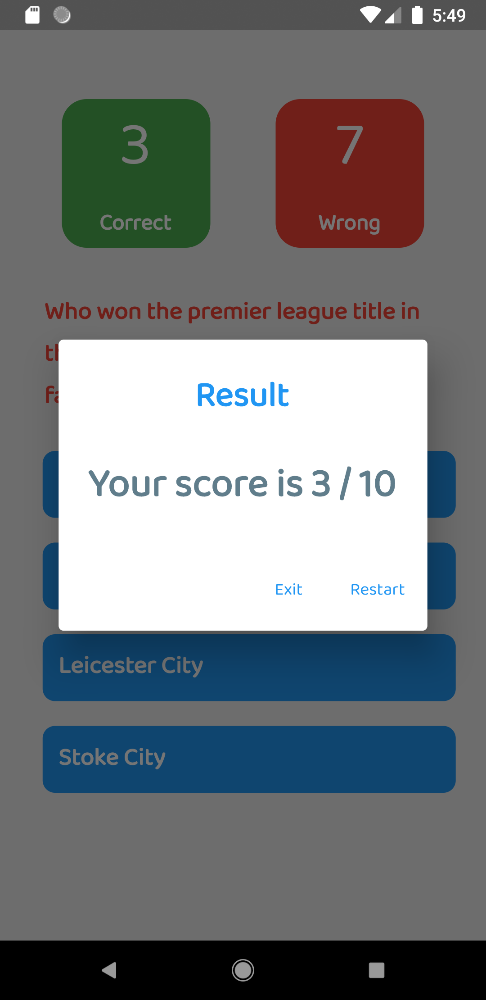

# Quiz

A Flutter quiz application using Flutter with the api <a href="https://opentdb.com/">Open Trivia Database</a>.

# dependencies
  - http: any
  - flutter_html: ^1.0.2

# Screenshots
  

  
   
  

## Getting Started

A few resources to get you started if this is your first Flutter project:

- [Lab: Write your first Flutter app](https://flutter.dev/docs/get-started/codelab)
- [Cookbook: Useful Flutter samples](https://flutter.dev/docs/cookbook)

For help getting started with Flutter, view our
[online documentation](https://flutter.dev/docs), which offers tutorials,
samples, guidance on mobile development, and a full API reference.
